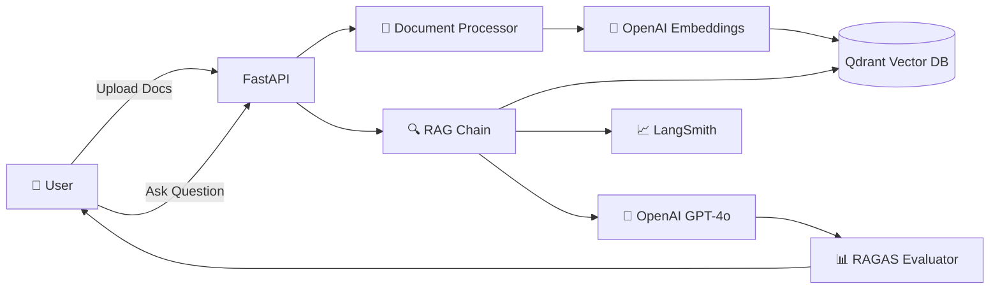

# 🤖 RAG Q&A System

### Production-Ready Retrieval-Augmented Generation with FastAPI & LangChain

[]
[]
[]
[]
[]
[]

---

## 📖 Overview

A **production-ready** RAG (Retrieval-Augmented Generation) system that enables intelligent Q&A over your documents. Built with modern AI stack and battle-tested in production environments.

### 🎯 What is RAG?

RAG combines the power of **retrieval** (finding relevant information) with **generation** (creating coherent answers) to provide accurate, context-aware responses to your questions based on your own documents.

### 🌟 Key Highlights

- 🚀 **Production Ready**: Docker + CI/CD + AWS deployment
- 🧠 **Smart AI**: Powered by OpenAI GPT-4o & LangChain
- 📊 **Observable**: LangSmith integration for full tracing
- ✅ **Evaluated**: RAGAS metrics for answer quality
- 🔒 **Secure**: Non-root Docker, API validation, error handling
- ⚡ **Fast**: Async operations, streaming responses
- 📈 **Scalable**: Cloud-native architecture

---

## ✨ Features

### 📄 Document Management
- ✅ Upload **PDF**, **TXT**, and **CSV** files
- ✅ Automatic text extraction and chunking
- ✅ Smart document splitting with overlap
- ✅ Vector storage in Qdrant Cloud

### 💬 Intelligent Q&A
- ✅ Natural language questions
- ✅ Context-aware answers
- ✅ Source attribution (see which docs were used)
- ✅ Streaming responses for real-time feedback
- ✅ Multiple query modes (standard, search-only)

### 🔍 Observability & Quality
- ✅ **LangSmith Tracing**: Full chain visibility, token tracking, cost analysis
- ✅ **RAGAS Evaluation**: Faithfulness & answer relevancy metrics
- ✅ **Structured Logging**: Comprehensive error tracking
- ✅ **Health Checks**: Readiness & liveness endpoints

### 🛠️ Developer Experience
- ✅ **Auto-generated Swagger docs** at `/docs`
- ✅ **Type-safe** Pydantic models
- ✅ **Comprehensive tests** with 70%+ coverage
- ✅ **Hot reload** in development
- ✅ **CI/CD pipeline** with GitHub Actions

---

## 🏗️ Architecture

### Tech Stack

| Component | Technology | Purpose |
|-----------|------------|---------|
| 🐍 Language | **Python 3.12** | Modern Python with type hints |
| 🚀 API Framework | **FastAPI** | High-performance async API |
| 🧠 RAG Framework | **LangChain** | LLM orchestration |
| 🗄️ Vector DB | **Qdrant Cloud** | Semantic search |
| 🔢 Embeddings | **text-embedding-3-small** | Document encoding |
| 🤖 LLM | **GPT-4o-mini** | Answer generation |
| 📊 Evaluation | **RAGAS** | Quality metrics |
| 🔍 Observability | **LangSmith** | Tracing & monitoring |
| 🐳 Container | **Docker** | Containerization |
| ☁️ Cloud | **AWS App Runner** | Serverless hosting |
| 🔄 CI/CD | **GitHub Actions** | Automated pipeline |

---